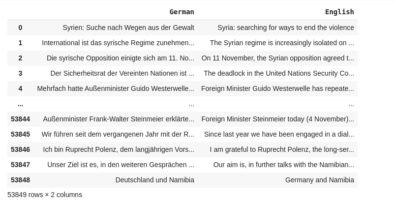

# german_to_english_translator
We are trying to build a model with a web app that will translate the German Language to English Language

The initial Data we have taken is German-English website parallel corpus from the Federal Foreign Office Berlin dataset which is openly available.

Initially it was in .tmx file and most of the things were irrelevent.So we need to clean up the data.

Only the 'seg' tag was needed , So we scrap out this tag.

